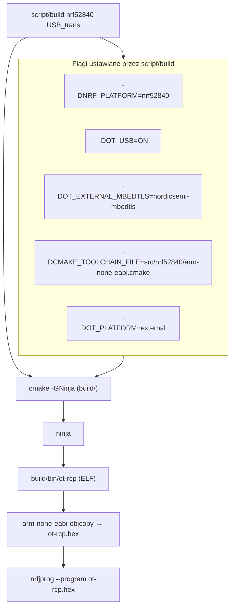
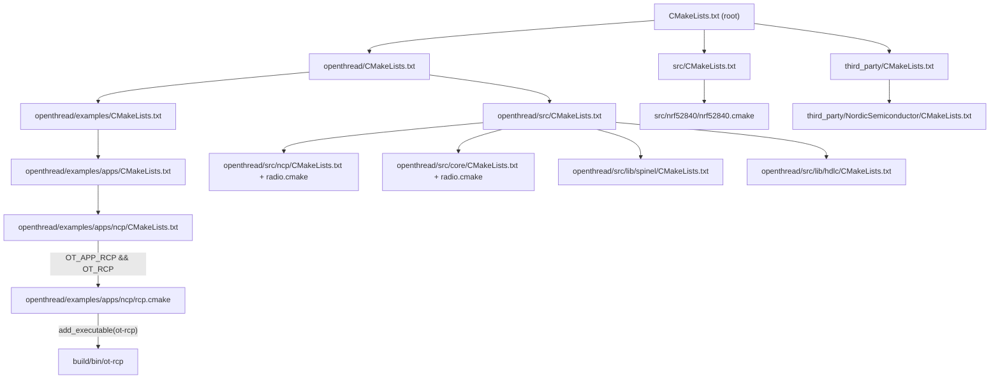
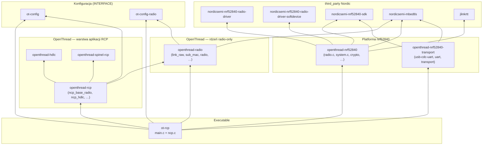
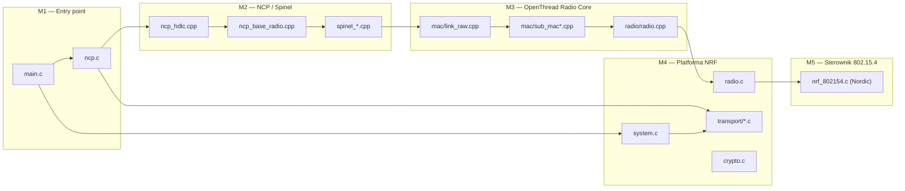
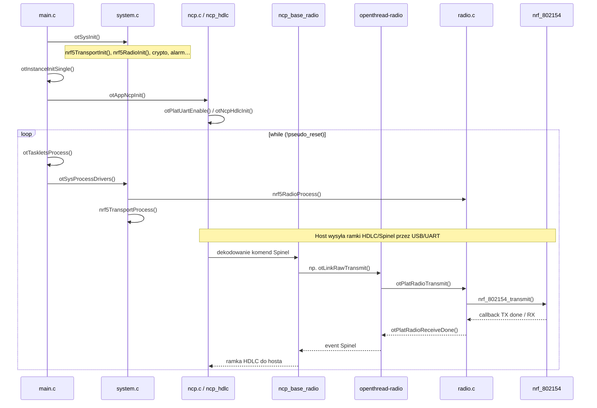
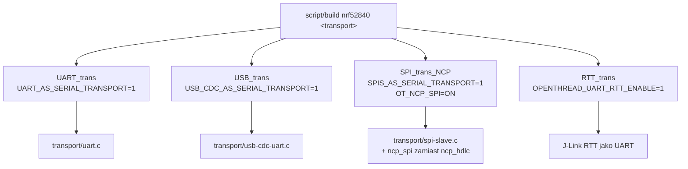

# RCP (Radio Co-Processor) — budowanie, CMake i linkowanie

> **Schematy blokowe (graficznie):** [RCP_DIAGRAM.md](RCP_DIAGRAM.md) — warstwy, linkowanie, pliki→biblioteki.  
> **Migracja nRF52 → nRF54:** [RCP_NRF52_TO_NRF54.md](RCP_NRF52_TO_NRF54.md)  
> **Dokładna lista third_party:** [RCP_THIRD_PARTY.md](RCP_THIRD_PARTY.md)

Dokument opisuje wyłącznie wariant **RCP** (`ot-rcp`) w projektu `ot-nrf528xx`.
Przykład referencyjny: **nrf52840 + USB_trans**.

```
./script/build nrf52840 USB_trans
arm-none-eabi-objcopy -O ihex build/bin/ot-rcp build/bin/ot-rcp.hex
```

---

## 1. Przepływ budowania (od skryptu do pliku)



### Co robi `script/build`

| Parametr | Efekt CMake / kompilacji |
|----------|--------------------------|
| `nrf52840` | `NRF_PLATFORM=nrf52840`, toolchain ARM |
| `USB_trans` | `OT_USB=ON` → `USB_CDC_AS_SERIAL_TRANSPORT=1` |
| (domyślnie) | `OT_APP_RCP=ON`, `OT_RCP=ON` — buduje `ot-rcp` |
| (domyślnie) | `OT_APP_CLI=ON`, `OT_APP_NCP=ON` — buduje też CLI i NCP |

> Dla samego RCP można ograniczyć build:  
> `OT_CMAKE_NINJA_TARGET=ot-rcp ./script/build nrf52840 USB_trans`

---

## 2. Hierarchia CMakeLists (tylko ścieżka RCP)



### Tabela plików CMake / .cmake

| Plik | Rola dla RCP |
|------|--------------|
| `CMakeLists.txt` | Root projektu; `OT_PLATFORM_LIB`, katalog wyjściowy `build/bin/` |
| `script/build` | Wrapper: platforma, transport, wywołanie cmake+ninja |
| `src/CMakeLists.txt` | Źródła platformy NRF, wybór transportu (USB/UART/SPI/RTT) |
| `src/nrf52840/nrf52840.cmake` | Biblioteki `openthread-nrf52840`, `openthread-nrf52840-transport` |
| `src/nrf52840/arm-none-eabi.cmake` | Toolchain `arm-none-eabi-gcc` |
| `openthread/etc/cmake/options.cmake` | `OT_APP_RCP`, `OT_RCP` i pozostałe opcje OT |
| `openthread/examples/apps/ncp/CMakeLists.txt` | Warunek włączenia `rcp.cmake` |
| `openthread/examples/apps/ncp/rcp.cmake` | **Definicja executabla `ot-rcp`** |
| `openthread/src/ncp/radio.cmake` | Biblioteka `openthread-rcp` |
| `openthread/src/core/radio.cmake` | Biblioteka `openthread-radio` |
| `openthread/src/lib/spinel/CMakeLists.txt` | `openthread-spinel-rcp` |
| `openthread/src/lib/hdlc/CMakeLists.txt` | `openthread-hdlc` |
| `third_party/NordicSemiconductor/CMakeLists.txt` | SDK, radio driver, mbedTLS |

---

## 3. Graf linkowania bibliotek



### Definicja linkowania w `rcp.cmake`

```cmake
target_link_libraries(ot-rcp PRIVATE
    openthread-rcp
    openthread-nrf52840
    openthread-nrf52840-transport
    openthread-radio
    openthread-nrf52840          # powtórzone w oryginalnym pliku
    openthread-nrf52840-transport
    openthread-rcp               # powtórzone w oryginalnym pliku
    ot-config-radio
    ot-config
)
```

`OT_PLATFORM_LIB` z root `CMakeLists.txt`:

```cmake
set(OT_PLATFORM_LIB "openthread-${NRF_PLATFORM}" "openthread-${NRF_PLATFORM}-transport")
# dla nrf52840 → openthread-nrf52840, openthread-nrf52840-transport
```

---

## 4. Moduły logiczne (ogólny podział)



| Moduł | Odpowiedzialność | Główne pliki |
|-------|------------------|--------------|
| **M1 Entry** | `main()`, pętla zdarzeń, init instancji OT | `openthread/examples/apps/ncp/main.c`, `ncp.c` |
| **M2 NCP/Spinel** | Protokół Spinel, ramkowanie HDLC, obsługa komend hosta | `openthread/src/ncp/*`, `openthread/src/lib/spinel/*`, `openthread/src/lib/hdlc/*` |
| **M3 Radio Core** | Link Raw, SubMac, ramki 802.15.4 (bez pełnego stacku FTD/MTD) | `openthread/src/core/mac/*`, `openthread/src/core/radio/*` |
| **M4 Platforma** | HAL nRF: radio, alarm, flash, crypto, transport szeregowy | `src/src/*.c`, `src/src/transport/*.c` |
| **M5 Nordic Radio** | Sterownik `nrf_802154`, SoftDevice, nrfx, USB stack | `third_party/NordicSemiconductor/**` |

---

## 5. Przepływ runtime (od `main` do radia)



### Pętla główna (`main.c`)

```c
otSysInit(argc, argv);
instance = otInstanceInitSingle();
otAppNcpInit(instance);

while (!otSysPseudoResetWasRequested()) {
    otTaskletsProcess(instance);
    otSysProcessDrivers(instance);   // radio + transport + alarm
}
```

### Most transportowy (`ncp.c` → platforma)

```c
// Odbiór z USB/UART:
void otPlatUartReceived(const uint8_t *aBuf, uint16_t aBufLength)
    → otNcpHdlcReceive()

// Wysyłka do hosta:
NcpSend() → otPlatUartSend()
```

Dla **USB_trans** implementacja `otPlatUart*` jest w `src/src/transport/usb-cdc-uart.c`
(z makrem `USB_CDC_AS_SERIAL_TRANSPORT=1`).

---

## 6. Źródła per target CMake

### `ot-rcp` (executable)

| Plik | Opis |
|------|------|
| `openthread/examples/apps/ncp/main.c` | `main()`, pętla, init instancji |
| `openthread/examples/apps/ncp/ncp.c` | `otAppNcpInit()`, most UART↔HDLC |

### `openthread-rcp` (biblioteka NCP)

| Plik | Opis |
|------|------|
| `ncp_base.cpp` | Bazowa obsługa NCP |
| `ncp_base_radio.cpp` | **Handler komend Spinel dla RCP** |
| `ncp_base_dispatcher.cpp` | Dyspozytor właściwości |
| `ncp_hdlc.cpp` | Ramkowanie HDLC |
| `ncp_spi.cpp` | (nieużywane przy USB/UART) |
| `changed_props_set.cpp` | Śledzenie zmienionych właściwości |
| `multipan_platform.cpp` | Multi-PAN (opcjonalnie) |

### `openthread-radio` (rdzeń — wybrane pliki)

| Obszar | Pliki |
|--------|-------|
| API | `api/link_raw_api.cpp`, `api/instance_api.cpp`, `api/diags_api.cpp` |
| MAC | `mac/link_raw.cpp`, `mac/sub_mac.cpp`, `mac/mac_frame.cpp` |
| Radio | `radio/radio.cpp`, `radio/radio_platform.cpp`, `radio/radio_callbacks.cpp` |
| Crypto | `crypto/aes_ccm.cpp`, `crypto/crypto_platform_mbedtls.cpp` |
| Diag | `diags/factory_diags.cpp` |

### `openthread-spinel-rcp`

`spinel.c`, `spinel_buffer.cpp`, `spinel_decoder.cpp`, `spinel_encoder.cpp`, `spinel_helper.cpp`, `spinel_prop_codec.cpp`

### `openthread-hdlc`

`hdlc.cpp`

### `openthread-nrf52840` (platforma)

| Plik | Opis |
|------|------|
| `src/alarm.c` | Timery platformy |
| `src/crypto.c` | CryptoCell / mbedTLS platform |
| `src/diag.c` | Diagnostyka platformy |
| `src/entropy.c` | Entropia |
| `src/fem.c` | Front-End Module |
| `src/flash.c` / `flash_nosd.c` | Flash / settings |
| `src/logging.c` | Logi platformy |
| `src/misc.c` | Różne HAL |
| `src/radio.c` | **`otPlatRadio*()` → nrf_802154** |
| `src/system.c` | **`otSysInit()` / `otSysProcessDrivers()`** |
| `src/temp.c` | Temperatura |

### `openthread-nrf52840-transport`

| Plik | Aktywny przy USB_trans |
|------|------------------------|
| `src/transport/transport.c` | tak — dispatcher transportu |
| `src/transport/usb-cdc-uart.c` | **tak — USB CDC ACM** |
| `src/transport/uart.c` | skompilowany, nieaktywny (#ifdef) |
| `src/transport/spi-slave.c` | skompilowany, nieaktywny (#ifdef) |

### `third_party` (nrf52840)

| Biblioteka | Zawartość |
|------------|-----------|
| `nordicsemi-nrf52840-radio-driver` | `nrf_802154.c` i moduły radia |
| `nordicsemi-nrf52840-radio-driver-softdevice` | Integracja ze SoftDevice |
| `nordicsemi-nrf52840-sdk` | nrfx, USB, clock, drivers |
| `nordicsemi-mbedtls` | mbedTLS + CryptoCell 310 |
| `jlinkrtt` | SEGGER RTT (logi/debug) |

---

## 7. Warianty transportu (wpływ na RCP)



Logika wyboru w `src/CMakeLists.txt`:

```cmake
if(OT_RTT_UART)       → OPENTHREAD_UART_RTT_ENABLE=1
elseif(OT_NCP_SPI)     → SPIS_AS_SERIAL_TRANSPORT=1
elseif(OT_USB)         → USB_CDC_AS_SERIAL_TRANSPORT=1   # USB_trans
else                   → UART_AS_SERIAL_TRANSPORT=1        # UART_trans
```

---

## 8. Pliki konfiguracyjne (preprocessor)

| Plik | Rola |
|------|------|
| `src/nrf52840/openthread-core-nrf52840-config.h` | Główna konfiguracja OT dla nrf52840 |
| `src/nrf52840/openthread-core-nrf52840-config-check.h` | Walidacja configu |
| `src/nrf52840/nrf52840.ld` | Linker script (lub `nrf52840_bootloader_usb.ld` z `OT_BOOTLOADER=USB`) |
| `src/nrf52840/transport-config.h` | Baudrate UART (dla wariantu UART) |
| `src/nrf52840/nrf52840-mbedtls-config.h` | Konfiguracja mbedTLS |

Definicje z root `CMakeLists.txt`:

```cmake
OPENTHREAD_PLATFORM_CORE_CONFIG_FILE="openthread-core-nrf52840-config.h"
OPENTHREAD_CORE_CONFIG_PLATFORM_CHECK_FILE="openthread-core-nrf52840-config-check.h"
```

---

## 9. Artefakty buildu

| Ścieżka | Opis |
|---------|------|
| `build/bin/ot-rcp` | ELF — gotowy do flashowania / debugowania |
| `build/bin/ot-rcp.map` | Mapa linkera (gdy `OT_LINKER_MAP=ON`) |
| `build/lib/libopenthread-*.a` | Biblioteki statyczne pośrednie |
| `build/bin/ot-rcp.hex` | HEX (po `objcopy`) — do `nrfjprog` |

### Flashowanie (przykład)

```bash
cd ~/src/ot-nrf528xx/build/bin
arm-none-eabi-objcopy -O ihex ot-rcp ot-rcp.hex

cd ~/nrfjprog/
./nrfjprog -f nrf52 -s <serial> --verify --chiperase \
    --program ~/src/ot-nrf528xx/build/bin/ot-rcp.hex --reset
```

---

## 10. Szybka ściągawka — „gdzie szukać czego"

| Chcę zmienić… | Plik / moduł |
|---------------|--------------|
| Pętlę główną, reset | `openthread/examples/apps/ncp/main.c` |
| Init NCP, most UART | `openthread/examples/apps/ncp/ncp.c` |
| Komendy Spinel RCP | `openthread/src/ncp/ncp_base_radio.cpp` |
| Logikę 802.15.4 (Link Raw) | `openthread/src/core/mac/link_raw.cpp` |
| Abstrakcję radia OT | `openthread/src/core/radio/radio_platform.cpp` |
| HAL radia nRF | `src/src/radio.c` |
| Sterownik Nordic 802.15.4 | `third_party/.../drivers/radio/nrf_802154.c` |
| USB CDC transport | `src/src/transport/usb-cdc-uart.c` |
| Init platformy | `src/src/system.c` |
| CMake executabla RCP | `openthread/examples/apps/ncp/rcp.cmake` |
| CMake platformy | `src/nrf52840/nrf52840.cmake` |
| Flagi buildu | `script/build` |

---

*Wygenerowano dla repozytorium ot-nrf528xx. Odniesienie: nrf52840 + USB_trans + target `ot-rcp`.*
