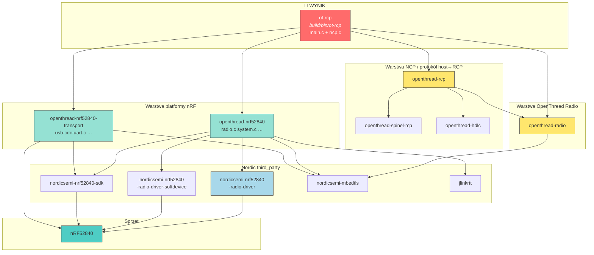
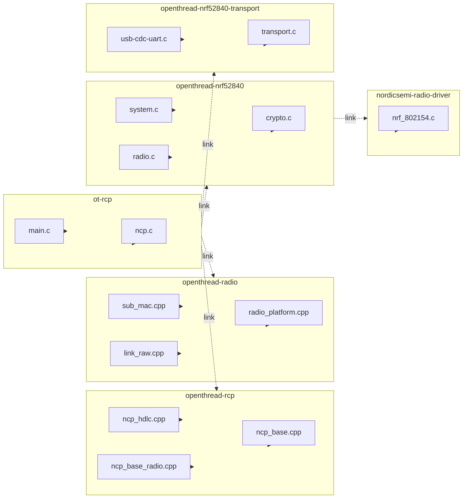

# RCP — schematy blokowe (budowanie i linkowanie)

Uzupełnienie do [RCP_BUILD.md](RCP_BUILD.md).  
Wariant: **nrf52840 + USB_trans** → target **`ot-rcp`**.

---

## Legenda

```
┌─────────┐
│  .exe   │  = plik wykonywalny (ELF)          → build/bin/
└─────────┘

┌─────────┐
│  .a     │  = biblioteka statyczna             → build/lib/
└─────────┘

┌─────────┐
│  .c/.cpp│  = pliki źródłowe kompilowane do biblioteki
└─────────┘

   ──►     = „linkuje się z” / „zależy od”
```

---

## 1. CO SIĘ BUDUJE — wynik końcowy i pośrednie artefakty

```
                    script/build nrf52840 USB_trans
                                    │
                                    ▼
    ┌───────────────────────────────────────────────────────────────┐
    │                        NINJA BUILD                            │
    └───────────────────────────────────────────────────────────────┘
                                    │
          ┌─────────────────────────┼─────────────────────────┐
          ▼                         ▼                         ▼
   build/lib/*.a            build/lib/*.a              build/bin/ot-rcp
   (biblioteki)             (biblioteki)               ★ WYNIK RCP ★
          │                         │                         │
          │                         │                         ▼
          │                         │                  objcopy → ot-rcp.hex
          │                         │                         │
          │                         │                         ▼
          │                         │                     nrfjprog
          └─────────────────────────┴─────────────────────────┘
                          wszystko linkowane
                          razem do ot-rcp
```

### Tabela: co ninja buduje (tylko to, co trafia do RCP)

| Artefakt | Typ | Ścieżka | Z czego powstaje |
|----------|-----|---------|------------------|
| **`ot-rcp`** | ELF ★ | `build/bin/ot-rcp` | `main.c` + `ncp.c` + wszystkie `.a` poniżej |
| `libopenthread-rcp.a` | .a | `build/lib/` | NCP layer (Spinel handler) |
| `libopenthread-radio.a` | .a | `build/lib/` | OpenThread radio core |
| `libopenthread-spinel-rcp.a` | .a | `build/lib/` | Kodek Spinel |
| `libopenthread-hdlc.a` | .a | `build/lib/` | Ramkowanie HDLC |
| `libopenthread-nrf52840.a` | .a | `build/lib/` | Platforma: radio, system, crypto… |
| `libopenthread-nrf52840-transport.a` | .a | `build/lib/` | USB/UART transport |
| `libnordicsemi-nrf52840-radio-driver.a` | .a | `build/lib/` | `nrf_802154.c` + moduły |
| `libnordicsemi-nrf52840-radio-driver-softdevice.a` | .a | `build/lib/` | Integracja SoftDevice |
| `libnordicsemi-nrf52840-sdk.a` | .a | `build/lib/` | nrfx, USB stack, clock… |
| `libjlinkrtt.a` | .a | `build/lib/` | SEGGER RTT (debug/log) |
| mbedTLS (via nordicsemi-mbedtls) | .a | `build/lib/` | Krypto |

> Domyślny build buduje **też** `ot-cli-ftd`, `ot-cli-mtd`, `ot-ncp-ftd` itd.  
> Powyższa tabela dotyczy **tylko ścieżki RCP**.

---

## 2. GŁÓWNY SCHEMAT BLOKOWY — warstwy i linkowanie

Widok „od góry do dołu”: wyżej = bliżej aplikacji, niżej = bliżej sprzętu.

```
╔═══════════════════════════════════════════════════════════════════════════╗
║  WARSTWA 0 — EXECUTABLE                                                   ║
║  ┌─────────────────────────────────────────────────────────────────────┐  ║
║  │  ot-rcp  (build/bin/ot-rcp)                                       │  ║
║  │  ┌──────────────┐  ┌──────────────┐                                 │  ║
║  │  │   main.c     │  │    ncp.c     │                                 │  ║
║  │  │  pętla main  │  │ init NCP,    │                                 │  ║
║  │  │  otSysInit   │  │ UART↔HDLC    │                                 │  ║
║  │  └──────────────┘  └──────────────┘                                 │  ║
║  └─────────────────────────────────────────────────────────────────────┘  ║
╚═══════════════════════════════════════════════════════════════════════════╝
         │ linkuje │
         ▼         ▼         ▼              ▼              ▼
╔═══════════════════════════════════════════════════════════════════════════╗
║  WARSTWA 1 — OPENTHREAD NCP / SPINEL                                      ║
║                                                                           ║
║  ┌──────────────────┐   ┌─────────────────────┐   ┌──────────────────┐   ║
║  │ openthread-rcp   │──►│ openthread-spinel-  │   │ openthread-hdlc  │   ║
║  │                  │   │ rcp                 │   │                  │   ║
║  │ ncp_base_radio   │   │ spinel.c            │   │ hdlc.cpp         │   ║
║  │ ncp_hdlc         │   │ spinel_encoder.cpp  │   │                  │   ║
║  │ ncp_base         │   │ spinel_decoder.cpp  │   │                  │   ║
║  └────────┬─────────┘   └─────────────────────┘   └──────────────────┘   ║
╚═══════════╪═══════════════════════════════════════════════════════════════╝
            │ linkuje
            ▼
╔═══════════════════════════════════════════════════════════════════════════╗
║  WARSTWA 2 — OPENTHREAD RADIO CORE (bez pełnego Thread stack)             ║
║  ┌─────────────────────────────────────────────────────────────────────┐  ║
║  │  openthread-radio                                                   │  ║
║  │  link_raw.cpp │ sub_mac.cpp │ radio.cpp │ radio_platform.cpp        │  ║
║  │  aes_ccm.cpp  │ factory_diags.cpp │ instance.cpp │ …                │  ║
║  └─────────────────────────────────────────────────────────────────────┘  ║
╚═══════════════════════════════════════════════════════════════════════════╝
            │ linkuje (otPlatRadio* API)
            ▼
╔═══════════════════════════════════════════════════════════════════════════╗
║  WARSTWA 3 — PLATFORMA NRF52840                                           ║
║                                                                           ║
║  ┌─────────────────────────────┐    ┌──────────────────────────────────┐  ║
║  │ openthread-nrf52840         │    │ openthread-nrf52840-transport    │  ║
║  │                             │    │                                  │  ║
║  │ radio.c  ◄── otPlatRadio*   │    │ transport.c                      │  ║
║  │ system.c ◄── otSysInit      │    │ usb-cdc-uart.c  ◄── USB_trans    │  ║
║  │ crypto.c │ alarm.c          │    │ uart.c (nieaktywny przy USB)     │  ║
║  │ flash.c  │ diag.c │ fem.c   │    │ spi-slave.c                      │  ║
║  └──────────────┬──────────────┘    └────────────────┬─────────────────┘  ║
╚═════════════════╪════════════════════════════════════╪════════════════════╝
                  │ linkuje                          │ linkuje
                  ▼                                  ▼
╔═══════════════════════════════════════════════════════════════════════════╗
║  WARSTWA 4 — NORDIC SDK + STEROWNIK 802.15.4                              ║
║                                                                           ║
║  ┌────────────────────────┐  ┌─────────────────────┐  ┌───────────────┐  ║
║  │ nordicsemi-nrf52840-   │  │ nordicsemi-nrf52840-│  │ nordicsemi-   │  ║
║  │ radio-driver           │  │ radio-driver-       │  │ nrf52840-sdk  │  ║
║  │                        │  │ softdevice          │  │               │  ║
║  │ nrf_802154.c ★         │  │ integracja S140     │  │ nrfx, USB,    │  ║
║  │ nrf_802154_*.c         │  │                     │  │ clock, drivers│  ║
║  └────────────────────────┘  └─────────────────────┘  └───────────────┘  ║
║                                                                           ║
║  ┌────────────────────────┐  ┌─────────────────────┐                     ║
║  │ nordicsemi-mbedtls     │  │ jlinkrtt            │                     ║
║  │ CryptoCell 310         │  │ logi debug          │                     ║
║  └────────────────────────┘  └─────────────────────┘                     ║
╚═══════════════════════════════════════════════════════════════════════════╝
            │
            ▼
     ┌─────────────┐
     │  nRF52840   │  sprzęt: radio 802.15.4 + USB
     └─────────────┘
```

---

## 3. GRAF LINKOWANIA (Mermaid) — kto kogo potrzebuje



---

## 4. PLIKI → BIBLIOTEKI (mapa kompilacji)

Który plik `.c`/`.cpp` ląduje w której bibliotece:



### Uproszczona tabela plik → biblioteka

| Plik źródłowy | Biblioteka | CMake definiuje w |
|---------------|------------|---------------------|
| `examples/apps/ncp/main.c` | **ot-rcp** (exe) | `rcp.cmake` |
| `examples/apps/ncp/ncp.c` | **ot-rcp** (exe) | `rcp.cmake` |
| `src/ncp/ncp_base_radio.cpp` | openthread-rcp | `ncp/radio.cmake` |
| `src/ncp/ncp_hdlc.cpp` | openthread-rcp | `ncp/CMakeLists.txt` |
| `src/lib/spinel/spinel*.cpp` | openthread-spinel-rcp | `lib/spinel/CMakeLists.txt` |
| `src/lib/hdlc/hdlc.cpp` | openthread-hdlc | `lib/hdlc/CMakeLists.txt` |
| `src/core/mac/link_raw.cpp` | openthread-radio | `core/radio.cmake` |
| `src/core/radio/radio_platform.cpp` | openthread-radio | `core/radio.cmake` |
| `src/src/radio.c` | openthread-nrf52840 | `src/CMakeLists.txt` |
| `src/src/system.c` | openthread-nrf52840 | `src/CMakeLists.txt` |
| `src/src/transport/usb-cdc-uart.c` | openthread-nrf52840-transport | `src/CMakeLists.txt` |
| `third_party/.../nrf_802154.c` | nordicsemi-nrf52840-radio-driver | `NordicSemiconductor/CMakeLists.txt` |

---

## 5. PRZEPŁYW DANYCH — schemat blokowy runtime

Jak pakiety idą między modułami w działającym RCP (USB):

```
  HOST (Linux / ot-daemon)
  ┌─────────────────────────────────────────┐
  │  Spinel frames over HDLC over USB CDC   │
  └──────────────────┬──────────────────────┘
                     │ /dev/ttyACM0
                     ▼
┌────────────────────────────────────────────────────────────────────────┐
│  RCP FIRMWARE (ot-rcp)                                                 │
│                                                                        │
│  ┌─────────────────┐      ┌─────────────────┐      ┌───────────────┐  │
│  │ usb-cdc-uart.c  │─────►│   ncp_hdlc.cpp  │─────►│ncp_base_radio │  │
│  │ otPlatUartRecv  │◄─────│   ramkowanie    │◄─────│  .cpp         │  │
│  │ otPlatUartSend  │      │   HDLC          │      │ dekoduj Spinel│  │
│  └─────────────────┘      └─────────────────┘      └───────┬───────┘  │
│         ▲ transport.c                                       │          │
│         │                                                   ▼          │
│  ┌──────┴──────────┐      ┌─────────────────┐      ┌───────────────┐  │
│  │   system.c      │      │  link_raw.cpp   │◄────►│  radio.c      │  │
│  │ otSysProcess    │─────►│  sub_mac.cpp    │      │ otPlatRadio*  │  │
│  │ Drivers()       │      │  (OT radio core)│      │               │  │
│  └─────────────────┘      └─────────────────┘      └───────┬───────┘  │
│         ▲ main.c pętla                                      │          │
│         │                                                   ▼          │
│  ┌──────┴──────────┐                              ┌───────────────┐  │
│  │   main.c        │                              │ nrf_802154.c  │  │
│  │ otTasklets      │                              │ TX / RX / CCA │  │
│  │ Process()       │                              └───────┬───────┘  │
│  └─────────────────┘                                      │          │
└───────────────────────────────────────────────────────────┼──────────┘
                                                            ▼
                                                   ┌───────────────┐
                                                   │  Antena 802.15.4 │
                                                   └───────────────┘
```

---

## 6. CMAKE — kto kogo woła (drzewo add_subdirectory)

```
CMakeLists.txt                          ← ROOT projektu ot-nrf528xx
│
├── add_subdirectory(openthread)
│   │
│   ├── openthread/CMakeLists.txt
│   │   ├── add_subdirectory(src)           → core, ncp, lib (hdlc, spinel)
│   │   └── add_subdirectory(examples)
│   │       └── examples/apps/CMakeLists.txt
│   │           └── ncp/CMakeLists.txt
│   │               └── include(rcp.cmake)  ★ tworzy ot-rcp
│   │
│   └── (options.cmake: OT_APP_RCP=ON, OT_RCP=ON)
│
├── add_subdirectory(src)
│   └── src/CMakeLists.txt
│       └── include(nrf52840/nrf52840.cmake)  ★ tworzy openthread-nrf52840*
│
└── add_subdirectory(third_party)
    └── NordicSemiconductor/CMakeLists.txt  ★ tworzy nordicsemi-*
```

---

## 7. JEDEN OBRAZEK — całość w pigułce

```
                    ┌─────────────────────────────────────┐
                    │         script/build                │
                    │    nrf52840  USB_trans              │
                    └─────────────────┬───────────────────┘
                                      │ cmake + ninja
                                      ▼
┌─────────────── PLIKI ŹRÓDŁOWE ───────────────┐     ┌─── LINKER ───┐
│                                              │     │              │
│  main.c ──┐                                  │     │              │
│  ncp.c  ──┼──► ot-rcp ◄──────────────────────┼─────┤  build/bin/  │
│           │       ▲                          │     │   ot-rcp     │
│           │       │ link                     │     │              │
│  ncp_*.cpp┼──► openthread-rcp ──► openthread-hdlc    └──────────────┘
│           │       │         └──► openthread-spinel-rcp
│           │       ▼
│  link_raw ┼──► openthread-radio ──► nordicsemi-mbedtls
│  radio.*  │       │
│           │       ▼
│  radio.c  ┼──► openthread-nrf52840 ──► nordicsemi-radio-driver
│  system.c │       │                 └──► nordicsemi-sdk
│           │       ▼
│  usb-cdc  ┼──► openthread-nrf52840-transport ──► nordicsemi-sdk
│           │       │
└───────────┼───────┼───────────────────────────────────────────────┘
            │       ▼
            │   nrf_802154.c ──► nRF52840 hardware
            │
            └── main() pętla: otTaskletsProcess + otSysProcessDrivers
```

---

## 8. Szybkie FAQ

**Co to jest `ot-rcp`?**  
Jeden plik ELF — firmware RCP. Zawiera kod z wszystkich bibliotek po zlinkowaniu.

**Czym różni się biblioteka od pliku wykonywalnego?**  
Biblioteka (`.a`) = skompilowane moduły bez `main()`.  
`ot-rcp` = `main.c` + wszystkie potrzebne `.a` zlinkowane razem.

**Co linkuje `rcp.cmake`?**  
Bezpośrednio: `openthread-rcp`, `openthread-nrf52840`, `openthread-nrf52840-transport`, `openthread-radio`, `ot-config`.

**Skąd biorą się pozostałe `.a`?**  
Transytywnie — np. `openthread-rcp` wymaga `openthread-hdlc` i `openthread-spinel-rcp`, a `openthread-nrf52840` wymaga `nordicsemi-*`.

**Gdzie jest `nrf_802154.c`?**  
W `libnordicsemi-nrf52840-radio-driver.a`, wołany z `src/src/radio.c`.

---

*Schematy dla ot-nrf528xx / RCP / nrf52840 / USB_trans.*

> **Migracja na nRF54:** [RCP_NRF52_TO_NRF54.md](RCP_NRF52_TO_NRF54.md)  
> **Moduły third_party (szczegóły):** [RCP_THIRD_PARTY.md](RCP_THIRD_PARTY.md)
