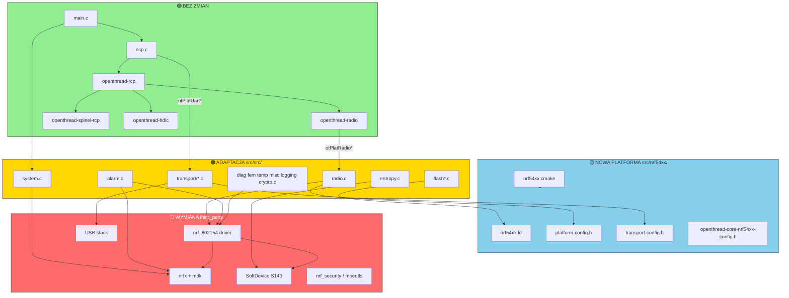
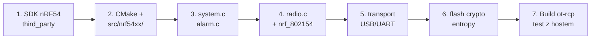

# RCP: migracja nRF52 → nRF54 — co się zmienia

> Uzupełnienie: [RCP_DIAGRAM.md](RCP_DIAGRAM.md) (obecna architektura nRF52840).  
> **Stan repozytorium:** obsługiwane są tylko `nrf52811`, `nrf52833`, `nrf52840`. **nRF54 nie istnieje jeszcze w tym repo** — poniższy schemat opisuje, co trzeba by przerobić przy porcie.

Przykład odniesienia: **nRF52840 RCP + USB** → docelowo **nRF54Lxx RCP**.

---

## Legenda kolorów

| Kolor | Znaczenie | Praca |
|-------|-----------|-------|
| 🟢 | **Bez zmian** | Kod współdzielony, niezależny od chipu |
| 🟡 | **Konfiguracja** | Nowe pliki config / CMake, małe `#ifdef` |
| 🟠 | **Adaptacja** | Ten sam moduł, ale API/peripherals inne — trzeba przepisać fragmenty |
| 🔴 | **Duża zmiana** | Nowy SDK, nowy driver, nowa architektura — większość od zera |

---

## 1. GŁÓWNY SCHEMAT — co zostaje, co idzie do poprawki

```
┌─────────────────────────────────────────────────────────────────────────────┐
│                         WARSTWA OPENTHREAD (host ↔ RCP)                     │
│  ┌─────────────┐  ┌──────────────┐  ┌─────────────┐  ┌─────────────────┐  │
│  │  main.c     │  │   ncp.c      │  │ ncp_hdlc    │  │ ncp_base_radio  │  │
│  │  ot-rcp     │  │              │  │ spinel      │  │ link_raw        │  │
│  └─────────────┘  └──────────────┘  └─────────────┘  └─────────────────┘  │
│                         🟢 BEZ ZMIAN (logika RCP/Spinel/HDLC)              │
└─────────────────────────────────────────────────────────────────────────────┘
                                      │
                                      │ otPlat* API (stabilny kontrakt OT)
                                      ▼
┌─────────────────────────────────────────────────────────────────────────────┐
│                    WARSTWA PLATFORMY (tu jest 90% pracy)                   │
│                                                                             │
│  ┌──────────┐ ┌──────────┐ ┌──────────┐ ┌──────────┐ ┌──────────────────┐  │
│  │ radio.c  │ │ system.c │ │ alarm.c  │ │ crypto.c │ │ transport/*.c    │  │
│  │  🔴/🟠   │ │   🟠     │ │   🟠     │ │   🔴     │ │      🟠          │  │
│  └────┬─────┘ └────┬─────┘ └────┬─────┘ └────┬─────┘ └────────┬─────────┘  │
│       │            │            │            │                 │            │
│  ┌────┴─────┐ ┌────┴────┐ ┌────┴────┐ ┌────┴─────┐ ┌─────────┴────────┐  │
│  │ flash*.c │ │entropy.c│ │ temp.c  │ │  fem.c   │ │ softdevice.c     │  │
│  │   🟠     │ │   🟠    │ │   🟠    │ │   🟠     │ │   🔴 (może zniknąć)│  │
│  └──────────┘ └─────────┘ └─────────┘ └──────────┘ └──────────────────┘  │
│                                                                             │
│  ┌─────────────────────────────────────────────────────────────────────┐   │
│  │  src/nrf52840/*  →  NOWY: src/nrf54xx/*          🟡 + 🔴          │   │
│  │  (config, linker, platform-config, transport-config)                │   │
│  └─────────────────────────────────────────────────────────────────────┘   │
└─────────────────────────────────────────────────────────────────────────────┘
                                      │
                                      ▼
┌─────────────────────────────────────────────────────────────────────────────┐
│                         third_party/NordicSemiconductor                     │
│                                                                             │
│  ┌─────────────────┐  ┌──────────────┐  ┌────────────┐  ┌──────────────┐  │
│  │ nrf_802154/*    │  │ nrfx + mdk   │  │ SoftDevice │  │ nrf_security │  │
│  │     🔴          │  │     🔴       │  │ S140  🔴   │  │ CC310  🔴    │  │
│  └─────────────────┘  └──────────────┘  └────────────┘  └──────────────┘  │
│  ┌─────────────────┐  ┌──────────────┐                                     │
│  │ USB stack       │  │ gcc_startup  │                                     │
│  │     🟠/🔴       │  │     🔴       │                                     │
│  └─────────────────┘  └──────────────┘                                     │
│                    🔴 CAŁY KATALOG DO WYMIANY na SDK nRF54                   │
└─────────────────────────────────────────────────────────────────────────────┘
                                      │
                                      ▼
                              ┌───────────────┐
                              │   nRF54L HW   │
                              └───────────────┘
```

---

## 2. MAPA MODUŁÓW — tabela migracji

### 🟢 Bez zmian (nie ruszasz przy zmianie chipu)

Te moduły **nie wołają** rejestrów nRF52 — działają na abstrakcji `otPlat*`:

| Moduł / plik | Biblioteka | Dlaczego bez zmian |
|--------------|------------|-------------------|
| `openthread/examples/apps/ncp/main.c` | ot-rcp | Pętla `main`, `otInstanceInit`, `otTaskletsProcess` |
| `openthread/examples/apps/ncp/ncp.c` | ot-rcp | Most `otPlatUart` ↔ HDLC (kontrakt OT) |
| `openthread/examples/apps/ncp/rcp.cmake` | — | Definicja targetu (nazwa lib platformy się zmieni) |
| `openthread/src/ncp/ncp_*.cpp` | openthread-rcp | Handler Spinel, NCP |
| `openthread/src/lib/spinel/*` | openthread-spinel-rcp | Kodek Spinel |
| `openthread/src/lib/hdlc/hdlc.cpp` | openthread-hdlc | Ramkowanie HDLC |
| `openthread/src/core/mac/link_raw.cpp` | openthread-radio | Link Raw |
| `openthread/src/core/radio/radio*.cpp` | openthread-radio | Rdzeń radia OT |
| `openthread/src/core/mac/sub_mac*.cpp` | openthread-radio | SubMac |
| Większość `openthread/` | — | Stack OT niezależny od Nordic |

---

### 🟡 Konfiguracja / CMake / nowe pliki platformy

Trzeba **dodać nową platformę** (wzorując się na `src/nrf52840/`):

| Plik / obszar | Co zrobić dla nRF54 |
|---------------|---------------------|
| `CMakeLists.txt` (root) | Dodać `nrf54xx` do `NRF_PLATFORM_VALUES` |
| `script/build` | Nowa sekcja `nrf54xx)` + typy transportu |
| `src/CMakeLists.txt` | `elseif(NRF_PLATFORM STREQUAL "nrf54xx")` + `include(nrf54xx/nrf54xx.cmake)` |
| **`src/nrf54xx/nrf54xx.cmake`** | **NOWY** — odpowiednik `nrf52840.cmake` |
| **`src/nrf54xx/arm-none-eabi.cmake`** | **NOWY** — toolchain (może ten sam ARM GCC) |
| **`src/nrf54xx/nrf54xx.ld`** | **NOWY** — mapa pamięci flash/RAM nRF54 |
| **`src/nrf54xx/platform-config.h`** | **NOWY** — RTC, IRQ, piny, stałe radia |
| **`src/nrf54xx/transport-config.h`** | **NOWY** — UART/USB/SPI piny i instancje |
| **`src/nrf54xx/openthread-core-nrf54xx-config.h`** | **NOWY** — opcje OT dla chipu |
| **`src/nrf54xx/openthread-core-nrf54xx-config-check.h`** | **NOWY** — walidacja configu |
| `third_party/NordicSemiconductor/CMakeLists.txt` | Nowe targety `nordicsemi-nrf54xx-*` |
| `config/nrf54xx/config/` | **NOWY** — `sdk_config.h`, `nrfx_config.h` |

---

### 🟠 Adaptacja — współdzielone `src/src/*.c` (logika zostaje, API się zmienia)

| Plik | Zależność od nRF52 | Co się zmieni na nRF54 |
|------|-------------------|------------------------|
| **`radio.c`** | `nrf_802154.h`, `NRF528XX_*` stałe, callbacki `nrf_802154_*` | Nowy driver 802.15.4 z SDK nRF54; inne stałe RX sensitivity/CCA; możliwe zmiany API timed TX/RX |
| **`system.c`** | `nrf_drv_clock`, `NRF52840_XXAA`, ICACHE, `nrf5CryptoInit` | Init chipu nRF54; inne flagi power/cache; kolejność init |
| **`alarm.c`** | `nrf_802154_lp_timer`, `nrf_drv_clock`, RTC | Nowy lp_timer backend; inny RTC/peripheral |
| **`diag.c`** | `nrf_802154_continuous_carrier`, CCA | Wołania do nowego drivera radia |
| **`fem.c`** | `nrf_802154`, FEM GPIO z config | Piny FEM, API FEM w nowym driverze |
| **`flash.c`** | Rozmiar strony 4096, adresy z linker script | Nowy layout flash, inny page size |
| **`flash_nosd.c`** | NVM bez SoftDevice | Adresy/settings partition |
| **`flash_sd.c`** | SoftDevice flash API | **Może nie być potrzebny** na nRF54 |
| **`entropy.c`** | `#if SOFTDEVICE_PRESENT` — RNG przez SD lub HW | Nowy źródło entropii (CRACEN / TRNG) |
| **`temp.c`** | `nrf_802154_temperature`, SoftDevice temp | Nowy sensor temp / inna integracja |
| **`misc.c`** | `NRF52840_XXAA`, SoftDevice SOC events | Chip-specific misc, reset reason |
| **`logging.c`** | RTT / UART log | Ewentualnie nowe piny/backend |
| **`transport/uart.c`** | `NRF_UARTE0`, `nrf_uarte`, piny z `transport-config.h` | Instancja UART, piny DK nRF54 |
| **`transport/usb-cdc-uart.c`** | Nordic USBD stack (`app_usbd`) | Nowy USB stack z nRF Connect SDK |
| **`transport/spi-slave.c`** | `NRFX_SPIS`, piny SPI | Nowe piny / SPIS instancja |
| **`transport/transport.c`** | Dispatch transportu | Ewentualnie nowe `#ifdef` dla nRF54 |

---

### 🔴 Duża zmiana / wymiana całkowita

| Moduł | Dlaczego duża zmiana | Uwagi nRF52 → nRF54 |
|-------|---------------------|---------------------|
| **`third_party/NordicSemiconductor/` (całość)** | Stary nrfx + driver z epoki nRF52 | Wymiana na SDK z obsługą nRF54 (nrfx 3.x / NCS) |
| **`drivers/radio/nrf_802154*.c`** | Sterownik 802.15.4 pod nRF52 RADIO | Nordic publikuje nową wersję pod nRF54 — **nie przenosisz, bierzesz nową** |
| **SoftDevice S140** (`softdevice/s140/`) | Model timeslot RAAL dla nRF52 | nRF54L prawdopodobnie **bez S140** — inny model współdzielenia radia (single-phy / MPSL) |
| **`softdevice.c`** + **`platform-softdevice.h`** | Helpery SD, `nrf_raal_softdevice` | Prawdopodobnie **usunąć lub zastąpić** RAAL single-phy / MPSL |
| **`nordicsemi-mbedtls` / CryptoCell 310** | `nrf_cc310`, `nrf-config.h` | nRF54 używa **CRACEN** — inna ścieżka krypto w `nrf_security` |
| **`crypto.c`** | `nrf_ecb` (AES ECB peripheral nRF52) | Nowy backend — CRACEN lub software mbedTLS |
| **`nrfx/mdk/`** (startup, linker, headers) | `nrf52840.h`, `gcc_startup_nrf52840.S` | `nrf54l*.h`, nowy startup, nowe IRQ |
| **`nrfx/hal/`, `nrfx/drivers/`** | HAL specyficzny dla nRF52 | Pełna wymiana |
| **`libraries/usb/`** | Stary USBD Nordic | Nowy driver USB w NCS |
| **`config/nrf52840/`** | `sdk_config.h` | Nowy katalog config dla nRF54 |

---

## 3. SCHEMAT ZALEŻNOŚCI — co jest przywiązane do nRF52



---

## 4. PORÓWNANIE WARSTW — nRF52840 vs nRF54 (oczekiwane różnice)

```
                    nRF52840 (dziś)              nRF54L (docelowo)
                    ───────────────              ─────────────────
MCU                 Cortex-M4F                   Cortex-M33
Radio driver        nrf_802154 (nRF52 RADIO)     Nowy nrf_802154 / 802.15.4 peripheral
Multiprotocol       SoftDevice S140 + RAAL       MPSL / single-phy (bez S140?)
Crypto HW           CryptoCell 310 (CC310)       CRACEN
AES w crypto.c      nrf_ecb peripheral           CRACEN / PSA / software
SDK w repo          Stary nrfx (nRF52)           nRF Connect SDK / nrfx 3.x
Startup             gcc_startup_nrf52840.S       gcc_startup_nrf54l*.S
Linker              nrf52840.ld                  nrf54l*.ld
USB RCP             app_usbd (legacy)            Nowy USB device stack
Flash page          4096 B                       Do weryfikacji w datasheet
Toolchain           arm-none-eabi-gcc            Prawdopodobnie ten sam (+ nowy FPU/flags)
```

---

## 5. KOLEJNOŚĆ PRAC (sugerowany plan portu)



| Krok | Moduły | Cel |
|------|--------|-----|
| **1** | `third_party/NordicSemiconductor/` | Nowy SDK, kompilacja `nordicsemi-nrf54xx-*` |
| **2** | `CMakeLists.txt`, `script/build`, `src/nrf54xx/*` | Projekt się konfiguruje i linkuje |
| **3** | `system.c`, `alarm.c`, `misc.c` | Chip startuje, timery działają |
| **4** | `radio.c` + nowy `nrf_802154` | RCP nadaje/odbiera 802.15.4 |
| **5** | `transport/usb-cdc-uart.c` lub `uart.c` | Host widzi Spinel po USB/UART |
| **6** | `flash*.c`, `crypto.c`, `entropy.c` | Settings, diag crypto |
| **7** | `ot-rcp` + `ot-daemon` / `ot-cli` na hoście | Test end-to-end RCP |

---

## 6. CO LINKUJE `ot-rcp` PO PORTCIE (zmiana nazw)

```
ot-rcp
 ├── openthread-rcp              🟢 bez zmian
 ├── openthread-radio            🟢 bez zmian
 ├── openthread-nrf54xx          🟡 nowa nazwa (było: openthread-nrf52840)
 ├── openthread-nrf54xx-transport 🟡 nowa nazwa
 ├── nordicsemi-nrf54xx-radio-driver      🔴 nowy
 ├── nordicsemi-nrf54xx-radio-driver-???  🔴 (softdevice lub MPSL — do ustalenia)
 ├── nordicsemi-nrf54xx-sdk               🔴 nowy
 ├── nordicsemi-mbedtls (CRACEN)          🔴 nowy backend
 └── jlinkrtt                             🟡 / 🟠 (może zostać)
```

Jedyna zmiana w `rcp.cmake`: `${OT_PLATFORM_LIB}` automatycznie wskaże `openthread-nrf54xx` po zmianie w root `CMakeLists.txt`.

---

## 7. CHECKLIST — pliki do przejrzenia / utworzenia

### Utworzyć od zera (kopia z nrf52840 jako szablon)

- [ ] `src/nrf54xx/nrf54xx.cmake`
- [ ] `src/nrf54xx/arm-none-eabi.cmake`
- [ ] `src/nrf54xx/nrf54xx.ld` (+ opcjonalnie bootloader `.ld`)
- [ ] `src/nrf54xx/platform-config.h`
- [ ] `src/nrf54xx/transport-config.h`
- [ ] `src/nrf54xx/openthread-core-nrf54xx-config.h`
- [ ] `src/nrf54xx/openthread-core-nrf54xx-config-check.h`
- [ ] `third_party/NordicSemiconductor/config/nrf54xx/config/sdk_config.h`
- [ ] `third_party/...` — cały pakiet SDK nRF54

### Przerobić (współdzielone źródła)

- [ ] `src/src/radio.c` — **największy plik platformy**
- [ ] `src/src/system.c`
- [ ] `src/src/alarm.c`
- [ ] `src/src/crypto.c`
- [ ] `src/src/entropy.c`
- [ ] `src/src/flash.c` / `flash_nosd.c` / `flash_sd.c`
- [ ] `src/src/transport/usb-cdc-uart.c`
- [ ] `src/src/transport/uart.c`
- [ ] `src/src/transport/spi-slave.c`
- [ ] `src/src/diag.c`, `fem.c`, `temp.c`, `misc.c`

### Prawdopodobnie usunąć / zastąpić

- [ ] `src/src/softdevice.c` — jeśli nRF54 bez S140
- [ ] `src/src/platform-softdevice.h`
- [ ] `third_party/.../softdevice/s140/` — cały katalog
- [ ] `third_party/.../rsch/raal/softdevice/` — zastąpić single-phy lub MPSL RAAL

### CMake / build

- [ ] `CMakeLists.txt` — `NRF_PLATFORM_VALUES`
- [ ] `src/CMakeLists.txt` — sekcja `nrf54xx`
- [ ] `script/build` — platforma + transport
- [ ] `third_party/NordicSemiconductor/CMakeLists.txt` — nowe biblioteki

### Nie ruszać (RCP)

- [ ] `openthread/examples/apps/ncp/main.c`
- [ ] `openthread/examples/apps/ncp/ncp.c`
- [ ] `openthread/examples/apps/ncp/rcp.cmake` (ew. tylko komentarz)
- [ ] `openthread/src/ncp/*` (warstwa Spinel)
- [ ] `openthread/src/core/radio/*`, `mac/link_raw.cpp`
- [ ] `openthread/src/lib/spinel/*`, `lib/hdlc/*`

---

## 8. Jedno zdanie podsumowania

**Zmiana nRF52 → nRF54 to przede wszystkim wymiana `third_party/NordicSemiconductor` i dodanie `src/nrf54xx/`, plus adaptacja `src/src/*.c` (szczególnie `radio.c`, `system.c`, transport i crypto) — warstwa OpenThread RCP (`main`, `ncp`, Spinel, HDLC, `link_raw`) zostaje bez zmian.**

---

*Dokument wygenerowany na podstawie analizy ot-nrf528xx. nRF54 nie jest jeszcze wspierany w tym repozytorium.*

> Szczegółowa lista plików `third_party`: [RCP_THIRD_PARTY.md](RCP_THIRD_PARTY.md)
