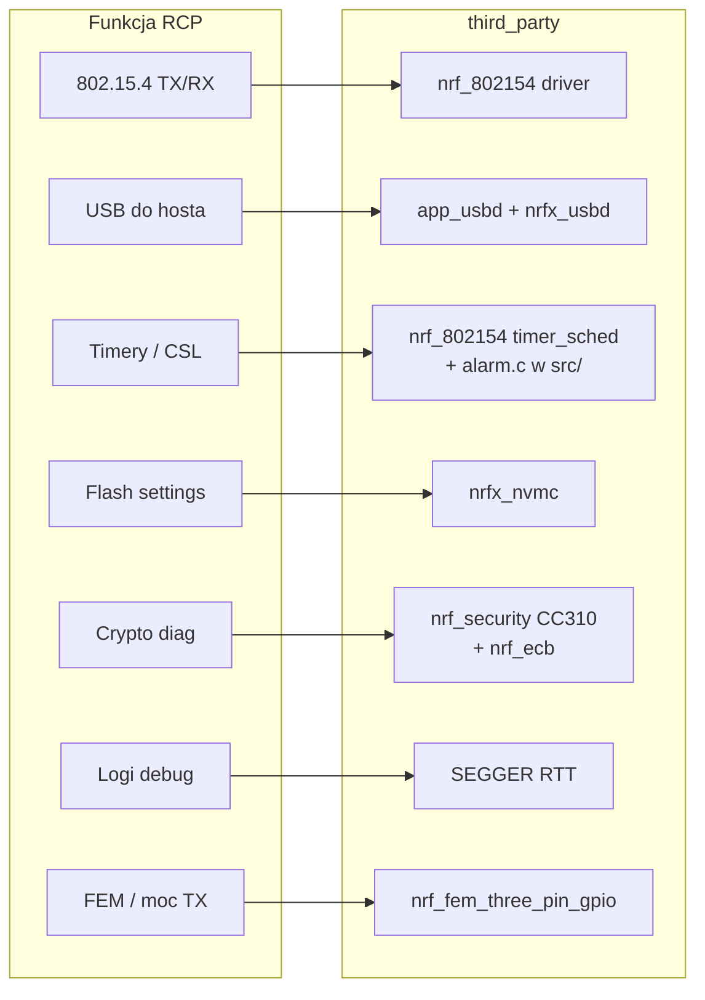

# RCP — dokładna lista modułów `third_party` (nrf52840)

> Uzupełnienie: [RCP_DIAGRAM.md](RCP_DIAGRAM.md), [RCP_NRF52_TO_NRF54.md](RCP_NRF52_TO_NRF54.md)  
> Wariant: **`./script/build nrf52840 USB_trans`** → target **`ot-rcp`**

Poniżej: **tylko to, co faktycznie trafia do linkowania RCP**, z pełnymi ścieżkami plików i wskazówką, czego szukać w SDK nRF54.

---

## 1. Jakie biblioteki `third_party` linkuje `ot-rcp`

```
ot-rcp
 └── openthread-nrf52840
      ├── nordicsemi-nrf52840-radio-driver          ← sterownik 802.15.4
      ├── nordicsemi-nrf52840-radio-driver-softdevice ← ten sam kod + flagi SD
      ├── nordicsemi-nrf52840-sdk                   ← nrfx, USB, startup
      ├── nordicsemi-mbedtls                        ← prebuilt .a (CC310)
      └── jlinkrtt                                  ← SEGGER RTT

 └── openthread-nrf52840-transport
      └── nordicsemi-nrf52840-sdk                   ← (współdzielony SDK)
```

Definicja w `src/CMakeLists.txt`:

```cmake
set(NRF52840_3RD_LIBS
    nordicsemi-nrf52840-radio-driver
    nordicsemi-nrf52840-radio-driver-softdevice
    nordicsemi-nrf52840-sdk
    jlinkrtt
)
```

Dla **USB_trans** dodatkowo: `-DOT_EXTERNAL_MBEDTLS=nordicsemi-mbedtls` (zamiast mbedTLS z `openthread/third_party/mbedtls`).

> **Uwaga:** `openthread/third_party/mbedtls` i `tcplp` **nie są używane** w tym wariancie RCP.

---

## 2. Mapa katalogów — co jest używane, a co leży „obok"

```
third_party/
├── jlink/                              ✅ UŻYWANE (jlinkrtt)
│   └── SEGGER_RTT_V640/RTT/SEGGER_RTT.c
│
└── NordicSemiconductor/                ✅ prawie wszystko poniżej jest używane
    ├── drivers/radio/                  ✅ nrf_802154 — rdzeń RCP
    ├── drivers/clock/                  ✅ nrf_drv_clock.c
    ├── drivers/power/                  ✅ nrf_drv_power.c (USB)
    ├── dependencies/                   ✅ app_util_platform.c, nrfx_config.h
    ├── libraries/
    │   ├── app_error/                  ✅
    │   ├── atfifo/                     ✅ USB
    │   ├── atomic/                     ✅ USB
    │   ├── usb/                        ✅ USB CDC (USB_trans)
    │   ├── utf_converter/              ✅
    │   └── nrf_security/               ✅ mbedtls + CC310 (prebuilt .a)
    ├── nrfx/
    │   ├── drivers/src/                ✅ clock, nvmc, power, spis, systick, usbd
    │   ├── hal/                        ✅ nagłówki + nrf_ecb.c, nrf_nvmc.c
    │   ├── mdk/                        ✅ startup, system_*.c, nrf52840.h
    │   └── soc/                        ✅ nrfx_atomic.c
    ├── cmsis/                          ✅ (include path)
    ├── config/
    │   ├── app_config.h                ✅ nadpisuje sdk_config dla OT
    │   └── nrf52840/config/sdk_config.h ✅
    ├── softdevice/s140/headers/        ⚠️ TYLKO nagłówki (nie binarka SD)
    └── segger_rtt/                     ✅ SEGGER_RTT_Conf.h (config RTT)
```

### ❌ W `third_party` jest, ale **NIE kompiluje się** do RCP nrf52840

| Ścieżka | Dlaczego nie |
|---------|--------------|
| `drivers/radio/rsch/raal/softdevice/nrf_raal_softdevice.c` | RCP używa **RAAL single-phy**, nie wersji softdevice |
| `drivers/radio/nrf_802154_*_swi.c` | Wersja SWI softdevice — nie w `RADIO_DRIVER_SOURCES` |
| `drivers/radio/platform/lp_timer/nrf_802154_lp_timer_nodrv.c` | Zamiast tego: **`src/src/alarm.c`** implementuje `nrf_802154_lp_timer_*` |
| `drivers/radio/platform/temperature/nrf_802154_temperature_none.c` | Zamiast tego: **`src/src/temp.c`** implementuje `nrf_802154_temperature_*` |
| `softdevice/s140/*.hex` (binarka) | Brak w repo — i tak nie flashujesz SD do RCP |
| `src/src/softdevice.c`, `flash_sd.c` | Nie wchodzą do `openthread-nrf52840` (tylko `flash_nosd.c`) |

---

## 3. Biblioteka po bibliotece — pliki źródłowe

### 3.1 `nordicsemi-nrf52840-radio-driver` + `...-softdevice`

Oba targety kompilują **ten sam zestaw plików** (`RADIO_DRIVER_SOURCES` + `RADIO_DRIVER_SINGLE_PHY_SOURCES`). Różnią się tylko flagami (`SOFTDEVICE_PRESENT`, `S140` w wariancie softdevice).

#### Rdzeń sterownika 802.15.4

| Plik | Rola |
|------|------|
| `drivers/radio/nrf_802154.c` | Główny API radia — **najważniejszy plik** |
| `drivers/radio/nrf_802154.h` | Nagłówek API (używany z `radio.c`) |
| `drivers/radio/nrf_802154_pib.c` / `.h` | PIB (adresy, kanał, promiscuous…) |
| `drivers/radio/nrf_802154_core.c` | Stan maszyny radia |
| `drivers/radio/nrf_802154_core_hooks.c` | Hooki core |
| `drivers/radio/nrf_802154_critical_section.c` | Sekcje krytyczne |
| `drivers/radio/nrf_802154_debug.c` | Debug |
| `drivers/radio/nrf_802154_rssi.c` | RSSI + kompensacja temperatury |
| `drivers/radio/nrf_802154_rx_buffer.c` | Bufory RX |
| `drivers/radio/nrf_802154_timer_coord.c` | Synchronizacja timerów |
| `drivers/radio/timer_scheduler/nrf_802154_timer_sched.c` | Scheduler timerów |

#### MAC features

| Plik | Rola |
|------|------|
| `drivers/radio/mac_features/nrf_802154_csma_ca.c` | CSMA-CA |
| `drivers/radio/mac_features/nrf_802154_delayed_trx.c` | Opóźnione TX/RX (CSL) |
| `drivers/radio/mac_features/nrf_802154_filter.c` | Filtr adresów |
| `drivers/radio/mac_features/nrf_802154_frame_parser.c` | Parser ramek |
| `drivers/radio/mac_features/nrf_802154_precise_ack_timeout.c` | Timeout ACK |
| `drivers/radio/mac_features/ack_generator/nrf_802154_ack_generator.c` | Generator ACK |
| `drivers/radio/mac_features/ack_generator/nrf_802154_imm_ack_generator.c` | Immediate ACK |
| `drivers/radio/mac_features/ack_generator/nrf_802154_enh_ack_generator.c` | Enhanced ACK |
| `drivers/radio/mac_features/ack_generator/nrf_802154_ack_data.c` | Dane ACK |

#### Platforma radia (wewnątrz drivera)

| Plik | Rola |
|------|------|
| `drivers/radio/platform/clock/nrf_802154_clock_ot.c` | Zegar dla OT |
| `drivers/radio/platform/hp_timer/nrf_802154_hp_timer.c` | High-precision timer |
| `drivers/radio/platform/coex/nrf_802154_wifi_coex_none.c` | Coexistence (stub) |
| `drivers/radio/fal/nrf_802154_fal.c` | Flash Abstraction Layer (wewn. drivera) |
| `drivers/radio/fem/three_pin_gpio/nrf_fem_three_pin_gpio.c` | FEM 3-pin GPIO |
| `drivers/radio/rsch/nrf_802154_rsch.c` | Radio Scheduler |
| `drivers/radio/rsch/nrf_802154_rsch_crit_sect.c` | RSCH critical section |

#### RAAL single-phy (model bez timeslotów SoftDevice)

| Plik | Rola |
|------|------|
| `drivers/radio/nrf_802154_notification_direct.c` | Powiadomienia (direct) |
| `drivers/radio/nrf_802154_priority_drop_direct.c` | Priority drop |
| `drivers/radio/nrf_802154_request_direct.c` | Request path |
| `drivers/radio/rsch/raal/single_phy/single_phy.c` | **RAAL single-phy** — dostęp do radia bez SD timeslot |

#### Nagłówki używane z `src/` (nie osobne .c w build)

| Nagłówek | Używany w |
|----------|-----------|
| `drivers/radio/platform/lp_timer/nrf_802154_lp_timer.h` | `alarm.c` — implementacja w platformie |
| `drivers/radio/platform/temperature/nrf_802154_temperature.h` | `temp.c` — implementacja w platformie |
| `drivers/radio/nrf_802154_utils.h` | `alarm.c` |

---

### 3.2 `nordicsemi-nrf52840-sdk`

#### COMMON_SOURCES (zawsze)

| Plik | Rola | Wołany z |
|------|------|----------|
| `dependencies/app_util_platform.c` | Utility platformy Nordic | ogólny SDK |
| `drivers/clock/nrf_drv_clock.c` | Driver zegara (legacy wrapper) | `system.c`, `alarm.c`, transport |
| `drivers/power/nrf_drv_power.c` | Power management | `usb-cdc-uart.c` |
| `libraries/app_error/app_error.c` | Obsługa błędów APP_ERROR | wszędzie |
| `libraries/app_error/app_error_weak.c` | Weak handler | wszędzie |
| `libraries/utf_converter/utf.c` | UTF-16 dla USB stringów | USB |
| `nrfx/drivers/src/nrfx_clock.c` | nrfx clock | pod spodem nrf_drv_clock |
| `nrfx/drivers/src/nrfx_nvmc.c` | Flash NVMC | `flash_nosd.c` |
| `nrfx/drivers/src/nrfx_power.c` | nrfx power | USB |
| `nrfx/drivers/src/nrfx_spis.c` | SPI Slave | `spi-slave.c` (skompilowany, nieaktywny przy USB) |
| `nrfx/drivers/src/nrfx_systick.c` | SysTick | USB stack |
| `nrfx/hal/nrf_ecb.c` | AES ECB peripheral | `crypto.c` |
| `nrfx/hal/nrf_nvmc.c` | HAL flash | flash |
| `nrfx/soc/nrfx_atomic.c` | Atomics | USB |

#### USB_SOURCES (tylko przy `USB_trans`)

| Plik | Rola |
|------|------|
| `nrfx/drivers/src/nrfx_usbd.c` | Sterownik USBD nRF52 |
| `libraries/atfifo/nrf_atfifo.c` | FIFO dla USB |
| `libraries/atomic/nrf_atomic.c` | Atomics Nordic |
| `libraries/usb/app_usbd.c` | USB Device stack — główny |
| `libraries/usb/app_usbd_core.c` | Core USBD |
| `libraries/usb/app_usbd_string_desc.c` | Deskryptory stringów |
| `libraries/usb/app_usbd_serial_num.c` | Numer seryjny USB |
| `libraries/usb/app_usbd_nrf_dfu_trigger.c` | DFU trigger (opcjonalny bootloader) |
| `libraries/usb/nrf_dfu_trigger_usb.c` | DFU trigger USB |
| `libraries/usb/class/cdc/acm/app_usbd_cdc_acm.c` | **USB CDC ACM** — transport RCP |

#### Startup / system (MDK)

| Plik | Rola |
|------|------|
| `nrfx/mdk/gcc_startup_nrf52840.S` | Reset vector, init RAM |
| `nrfx/mdk/system_nrf52840.c` | `SystemInit()` |
| `nrfx/mdk/nrf52840.h` | Rejestry peryferiów (include) |
| `nrfx/mdk/nrf52840_xxaa.ld` | (używany pośrednio; faktyczny linker script: `src/nrf52840/nrf52840.ld`) |

---

### 3.3 `nordicsemi-mbedtls` (INTERFACE — prebuilt)

Ścieżka: `libraries/nrf_security/lib/`

| Plik `.a` | Rola |
|-----------|------|
| `libmbedcrypto_cc3xx.a` | **CryptoCell 310** — akceleracja AES/ECDH/ECDSA |
| `libnrf_cc310_platform_0.9.4.a` | Platform layer CC310 |
| `libmbedcrypto_oberon.a` | Oberon (część algorytmów) |
| `libmbedcrypto_shared.a` | Wspólne crypto |
| `libmbedtls_base_vanilla.a` | mbedTLS base |
| `libmbedtls_tls_vanilla.a` | TLS (linkowany, RCP mało używa) |
| `libmbedtls_x509_vanilla.a` | X509 |

#### Nagłówki config (include path)

| Plik | Rola |
|------|------|
| `libraries/nrf_security/config/nrf-config.h` | Główny config mbedTLS Nordic |
| `libraries/nrf_security/mbedtls_plat_config/nrf52840-mbedtls-config.h` | Per-chip overlay |
| `libraries/nrf_security/include/mbedtls/*.h` | API mbedTLS |
| `libraries/nrf_security/nrf_cc310_plat/include/*.h` | API CC310 platform |

Dodatkowo w `src/src/crypto.c`: **`hal/nrf_ecb.h`** + `nrf_ecb.c` — szybki AES ECB na peryferium (nie CC310).

---

### 3.4 `jlinkrtt`

| Plik | Rola |
|------|------|
| `third_party/jlink/SEGGER_RTT_V640/RTT/SEGGER_RTT.c` | SEGGER RTT — logi debug |
| `third_party/NordicSemiconductor/segger_rtt/SEGGER_RTT_Conf.h` | Konfiguracja buforów RTT |

---

## 4. Config / nagłówki systemowe (nie są `.o`, ale są wymagane)

| Plik | Rola |
|------|------|
| `config/app_config.h` | Włącza USB CDC, clock, power, RTT, NVMC |
| `config/nrf52840/config/sdk_config.h` | Domyślna konfiguracja nRF SDK |
| `dependencies/nrfx_config.h` | `#include <sdk_config.h>` |
| `nrfx/templates/nRF52840/nrfx_config.h` | Szablon (referencyjny) |
| `softdevice/s140/headers/*.h` | Nagłówki BLE SD (include path; **brak linkowanej binarki SD**) |

---

## 5. Schemat: który moduł `third_party` obsługuje którą funkcję RCP



---

## 6. Warianty transportu — różnice w `third_party`

| Moduł `third_party` | UART_trans | USB_trans | SPI_trans_NCP |
|---------------------|------------|-----------|---------------|
| `USB_SOURCES` (app_usbd, nrfx_usbd) | ❌ | ✅ | ❌ |
| `nrfx_spis.c` | skompilowany | skompilowany | **aktywny** |
| `drivers/power/nrf_drv_power.c` | ❌* | ✅ | ❌* |
| `libraries/atfifo`, `atomic` | ❌ | ✅ | ❌ |

\*skompilowane w COMMON, ale power głównie dla USB init

---

## 7. Tabela „szukaj odpowiednika w nRF54 SDK"

Użyj tego jako checklisty przy porcie — kolumna **obecnie w ot-nrf528xx** → **gdzie szukać w NCS / nRF54**.

| # | Moduł w tym repo | Ścieżka w repo | Odpowiednik nRF54 (NCS) | Uwagi |
|---|------------------|----------------|-------------------------|-------|
| 1 | **Sterownik 802.15.4** | `drivers/radio/nrf_802154*` | `nrf_802154` w NCS (nrfxlib / Zephyr module) | Nowa wersja drivera, inne peryferium RADIO |
| 2 | **RAAL single-phy** | `rsch/raal/single_phy/single_phy.c` | RAAL dla nRF54 / MPSL single-core | Model dostępu do radia może się zmienić |
| 3 | **RAAL softdevice** | `rsch/raal/softdevice/` | **MPSL** (Multiprotocol Service Layer) | Zamiast S140 |
| 4 | **SoftDevice S140 headers** | `softdevice/s140/headers/` | MPSL / brak SD | Binarka SD nie jest flashowana do RCP |
| 5 | **nrfx MDK** | `nrfx/mdk/nrf52840.*` | `nrf54l*_xxaa.h`, `gcc_startup_nrf54l*.S` | Nowy chip header + startup |
| 6 | **nrfx drivers** | `nrfx/drivers/src/nrfx_*.c` | nrfx 3.x w NCS | Clock, NVMC, USB — nowe API |
| 7 | **nrf_drv_clock** (legacy) | `drivers/clock/nrf_drv_clock.c` | `nrfx_clock` / clock control w NCS | Legacy wrapper może zniknąć |
| 8 | **nrf_drv_power** | `drivers/power/nrf_drv_power.c` | `nrfx_power` / regulator API nRF54 | Inna architektura power |
| 9 | **USB CDC (app_usbd)** | `libraries/usb/app_usbd*.c`, `app_usbd_cdc_acm.c` | USB device stack w NCS dla nRF54 | Inny stack, nie `app_usbd` 1:1 |
| 10 | **nrfx_usbd** | `nrfx/drivers/src/nrfx_usbd.c` | USBD driver nRF54 w nrfx | Nowy peripheral USB |
| 11 | **nrfx_spis** | `nrfx/drivers/src/nrfx_spis.c` | `nrfx_spis` dla nRF54 | Inne instancje/piny |
| 12 | **nrf_ecb** | `nrfx/hal/nrf_ecb.c` | **CRACEN** / PSA Crypto | ECB peripheral może nie istnieć |
| 13 | **nrf_security / CC310** | `libraries/nrf_security/lib/lib*_cc3xx.a` | `nrf_security` + **CRACEN** | `libmbedcrypto_cracen.a` zamiast cc3xx |
| 14 | **nrf_cc310_platform** | `nrf_cc310_plat/` | CRACEN platform / `nrf_security` | Nowe nagłówki platform crypto |
| 15 | **nrf-config.h** | `libraries/nrf_security/config/nrf-config.h` | `nrf-config.h` z NCS dla nRF54 | Nowy config |
| 16 | **FEM 3-pin** | `fem/three_pin_gpio/nrf_fem_three_pin_gpio.c` | FEM driver w NCS 802.15.4 | Może być ten sam koncept, inne piny |
| 17 | **SEGGER RTT** | `third_party/jlink/SEGGER_RTT*` | SEGGER RTT (bez zmian) | Przenośny |
| 18 | **CMSIS** | `cmsis/` | CMSIS-Core dla Cortex-M33 | Aktualizacja |
| 19 | **app_error** | `libraries/app_error/` | `app_error` w NCS lub własne | Podobne |
| 20 | **sdk_config / app_config** | `config/` | `Kconfig` / `prj.conf` w NCS lub nowy `app_config.h` | Inny system konfiguracji |

---

## 8. Co linkować w CMake dla nRF54 (szablon)

Na wzór obecnego `third_party/NordicSemiconductor/CMakeLists.txt`:

```
nordicsemi-nrf54xx-radio-driver      ← nowy nrf_802154 z NCS
nordicsemi-nrf54xx-radio-driver-???  ← MPSL lub single-phy (do ustalenia)
nordicsemi-nrf54xx-sdk               ← nrfx + startup + USB/UART/SPI
nordicsemi-mbedtls                   ← nrf_security z CRACEN
jlinkrtt                             ← bez zmian
```

---

## 9. Szybka odpowiedź: „które katalogi skopiować / wymienić"

Jeśli portujesz na nRF54, **nie kopiujesz selektywnie** — bierzesz świeży pakiet z NCS i mapujesz:

| Priorytet | Katalog w `third_party/NordicSemiconductor/` | Akcja |
|-----------|-----------------------------------------------|-------|
| 🔴 1 | `drivers/radio/` | Wymień na nrf_802154 z NCS dla nRF54 |
| 🔴 2 | `nrfx/` | Wymień na nrfx 3.x |
| 🔴 3 | `libraries/nrf_security/` | Wymień (CRACEN) |
| 🔴 4 | `libraries/usb/` + `nrfx_usbd` | Wymień na USB stack nRF54 |
| 🟠 5 | `drivers/clock/`, `drivers/power/` | Adaptuj lub użyj czystego nrfx |
| 🟠 6 | `softdevice/` | Zastąp MPSL lub usuń |
| 🟡 7 | `config/` | Nowy `sdk_config` / `app_config` |
| 🟢 8 | `third_party/jlink/` | Zostaw (ew. update wersji RTT) |

---

*Wygenerowano z analizy `third_party/NordicSemiconductor/CMakeLists.txt` i łańcucha linkowania `ot-rcp` / nrf52840 / USB_trans.*
